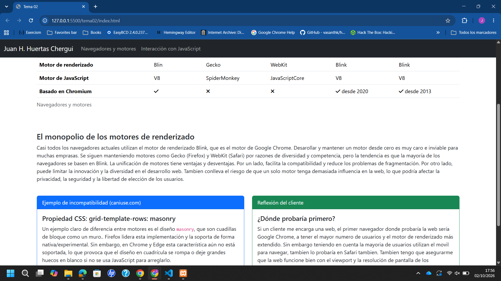
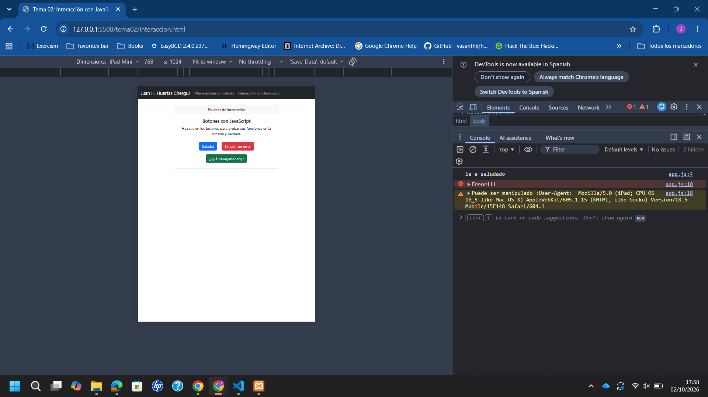
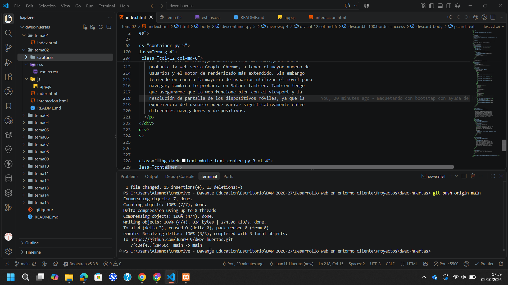

# DWEC - Tema 2: Navegadores, motores y primera página interactiva

**Autor/a:** Juan Hakram Huertas Chergui
**Curso:** 2º DAW (2026/2027)

Este repositorio contiene la solución a la Tarea 2. Consta de dos páginas web: una teórica sobre los motores de los navegadores (`index.html`) y otra práctica sobre la interacción con JavaScript (`interaccion.html`), ambas maquetadas mediante el framework CSS Bootstrap.

---

## 1. Evidencias Gráficas (Capturas)

### A. Página principal en ordenador

> Vista de la página `index.html` en versión de escritorio. En la barra de navegación superior (navbar) se puede comprobar mi nombre y apellidos.

### B. Página de interacción simulando móvil

> Vista de la página `interaccion.html` utilizando las herramientas de desarrollador (F12) en modo dispositivo. Se comprueba que el diseño es _responsive_, los botones se apilan correctamente y no hay necesidad de scroll horizontal.

### C. Trazas en la consola

> Consola del navegador tras haber pulsado los tres botones. Se aprecian claramente los mensajes de `console.log()` (información estándar) y el mensaje en rojo generado por `console.error()`.

### D. Alerta de navegadores (Chrome y Firefox)

!tema02/capturas/mozilla.png

> Alertas emergentes generadas por el botón "¿Qué navegador soy?", ejecutadas en dos navegadores diferentes (por ejemplo, Chrome y Firefox). Muestran la cadena exacta del `userAgent` de cada uno.

### E. Entorno de desarrollo

> Mi entorno de trabajo en Visual Studio Code, con la estructura de carpetas `tema02` visible en el panel lateral y el puerto del Live Server activo en la barra inferior.

---

## 2. Quién hace qué (Análisis de un botón)

He elegido el botón **"Saludar"** de la página `interaccion.html` para analizar la separación de capas en el desarrollo front-end:

- **El HTML:** Se encarga de la **estructura**. Crea el elemento en sí mismo mediante la etiqueta `<button>`. Además, proporciona el texto visible para el usuario ("Saludar") y hace de puente con la lógica usando el atributo `onclick="saludar()"`.
- **Bootstrap (CSS):** Se encarga de la **presentación**. A través de las clases `btn`, `btn-primary` y `m-2`, Bootstrap le da al botón su color azul característico, redondea los bordes, añade un efecto visual al pasar el ratón por encima y le aplica márgenes para que respire, todo esto sin que yo haya tenido que escribir ni una sola regla de CSS a mano.
- **JavaScript:** Se encarga del **comportamiento**. Cuando el HTML detecta el clic, llama a JavaScript para que ejecute la función `saludar()`. Este lenguaje es el que realmente detiene la pantalla para lanzar el `alert()` y manda el texto de registro por detrás hacia la consola.

---

## 3. Comparativa de UserAgents

Al ejecutar el botón "¿Qué navegador soy?" en diferentes navegadores, obtenemos cadenas de texto (User-Agent) como estas:

- **Chrome:** `Mozilla/5.0 (Windows NT 10.0; Win64; x64) AppleWebKit/537.36 (KHTML, like Gecko) Chrome/118.0.0.0 Safari/537.36`
- **Firefox:** `Mozilla/5.0 (Windows NT 10.0; Win64; x64; rv:118.0) Gecko/20100101 Firefox/118.0`

**¿Qué partes reconozco?**
Reconozco fácilmente el sistema operativo del usuario (`Windows NT 10.0; Win64` indica Windows 10 u 11 de 64 bits), el motor real en algunos casos (`Gecko` en Firefox) y el nombre y versión del navegador final (`Chrome/118.0.0.0` o `Firefox/118.0`).

**¿Por qué aparecen "Mozilla", "AppleWebKit" o "Safari" en Chrome?**
Es por razones históricas de compatibilidad (conocido como _User-Agent spoofing_). En los inicios de la web, muchos servidores solo enviaban páginas modernas si detectaban el navegador "Mozilla" (Netscape). Para que las páginas se vieran bien, el resto de navegadores empezaron a fingir ser Mozilla. Más tarde, para recibir CSS avanzado, fingían ser Safari (AppleWebKit/KHTML). Hoy en día, casi todos los navegadores arrastran esta "mentira histórica" en su cadena para evitar que servidores antiguos rompan la maquetación web.

---

## 4. Fuentes consultadas

- Apuntes del Tema 2: "Lenguajes y herramientas de programación en clientes web" (Material de Davante).
- Repositorio oficial de la asignatura para la plantilla base de Bootstrap.
- **Can I Use:** Base de datos de compatibilidad web. Consultado para documentar incompatibilidades HTML/CSS. ([https://caniuse.com/](https://caniuse.com/))

## 5. Uso de IA

Se ha utilizado inteligencia artificial (Google Gemini) como herramienta de asistencia educativa para: ayudar a maquetar correctamente el código HTML siguiendo el sistema de rejillas de Bootstrap, buscar información técnica contrastada (como los ejemplos de incompatibilidad de _Masonry CSS_ y `<datalist>` en _caniuse.com_), entender y asimilar conceptos teóricos (el monopolio de motores Blink y cómo funciona el diseño Masonry), agilizar el proceso general de desarrollo del proyecto y ayudar a estructurar y redactar este archivo `README.md`. Todo el código y las explicaciones teóricas aportadas han sido revisadas, comprendidas e integradas bajo mi criterio.
