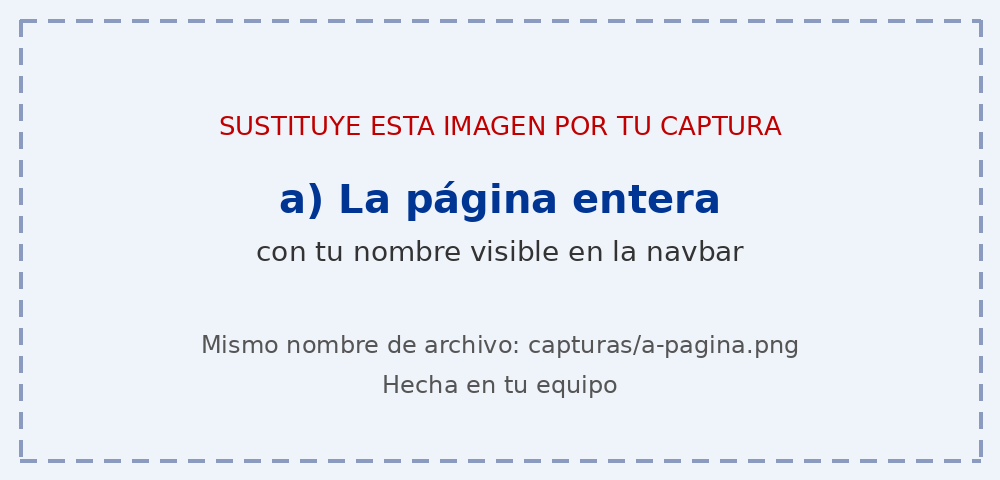
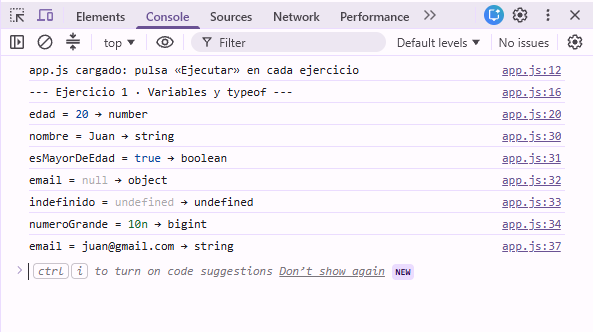
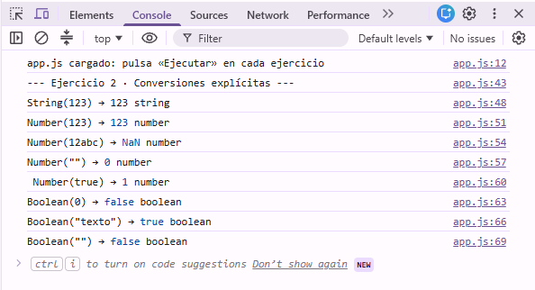
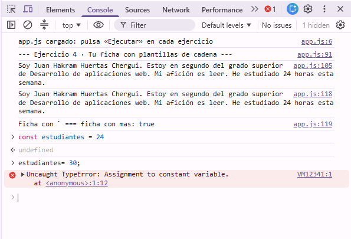

# Tarea 3 · Variables, tipos y conversiones

**Autor:** Juan Hakram Huertas Chergui · Desarrollo Web en Entorno Cliente (DWEC) · 2.º DAW · Curso 2026-27

En esta carpeta trabajo con variables, tipos de datos y conversiones. Para probar: abrir la carpeta en VS Code, pulsar **Go Live**, abrir la consola con F12 y pulsar «Ejecutar» en cada ejercicio..

## Capturas

### a) La página entera

Se ve mi nombre en la navbar, las cuatro cards y los fallos de predicción marcados.

### b) Consola del ejercicio 1

Cada variable con su valor y su `typeof`. Se ve que `typeof null` devuelve `object`

### c) Consola del ejercicio 2

Las conversiones explícitas con su tipò. Todo string da 0 con `Number()` y falso con `Boolean`.

### d) Consola del ejercicio 3

Las comparaciones con `==` y `===` y coerciones. Con el simbolo +, Con `+` hay que convertir antes si queremos sumar, para no concatenar sin querer.

### e) Consola del ejercicio 4, con el error de la const

En el resultado de consola se ve que las dos maneras de concatenar dan el mismo resultado, auque es mucho mas intuitivo utilizar backticks. El error de `const` es porque un constante no se puede reasignar.
## Reflexión

### ¿Qué conversiones me resultaron más intuitivas y cuáles me sorprendieron? 
La conversiones de Boolean() me resularon las mas intuitivas, porque un valor vacio o cero da `false` y un `string` con contenido o un numero que no sea 0 da `true`. Con `Number()` tambien acerte en mis predicciones. La conversiòn de un valor alfanumérico con `Number()` da NaN(Not a number) y una cadena vacia da 0.

## Fuentes

- [web.dev -nulo e indefinido](https://web.dev/learn/javascript/data-types/null-undefined?hl=es-419)

## Uso de IA

 **Herramienta:** Claude.ia
 **Fecha:** 09/10/2026
 **Pregunta:** Corrige los fallos de ortografía y la redacción de Readme.md y captura de pantalla.
 **Uso:** Con el listado de errores, maunalmente corregir cada error.
